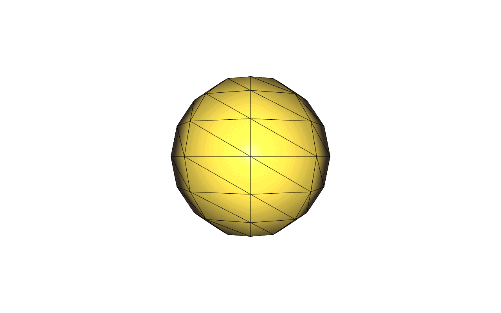
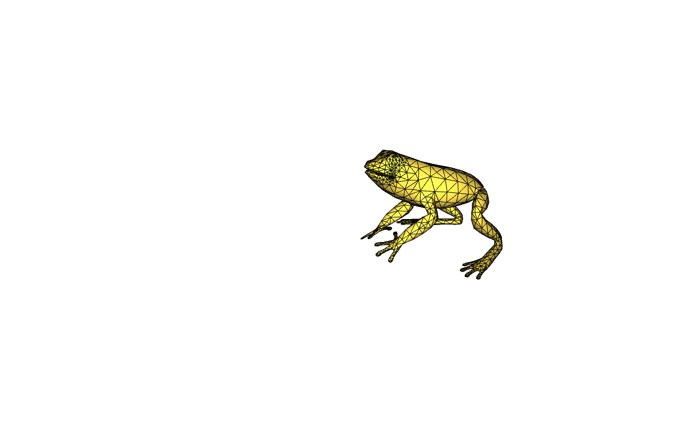

# Complementary Dynamics cpp

Public c++ code release for the SIGGRAPH Asia 2020 paper [Complementary Dynamics](https://www.dgp.toronto.edu/projects/complementary-dynamics/) by Jiayi Eris Zhang, Seungbae Bang, David I.W. Levin and Alec Jacobson.

# Dependency

[libigl](https://github.com/libigl)\
[Bartels](https://github.com/dilevin/Bartels)

# Setup

Before running the code, you need to setup the following.\
Compile static library `libbartels` with Bartels:

    cd Bartles
    mkdir build
    cd build
    cmake .. -Dbartels_USE_STATIC_LIBRARY=ON
    make -j8

Compile static library `libigl` with libigl:

    cd libigl
    mkdir build
    cd build
    cmake .. -DLIBIGL_USE_STATIC_LIBRARY=ON
    make -j8

# Run

Run examples by `./complementary_dynamics ../examples/example/example.json` (with `example` being one example in provided in `examples` folder). For instance, try running following command

    ./complementary_dynamics ../examples/sphere/sphere.json

all parameter for physical model is defined in `examples\example.json`. try tweaking parameter and see how it effects the result.

Here are examples running `sphere` in different physical model:

ARAP|Neohookean|StVK|CoRotational
----|----------|----|------------
 |  |  | 

Here are exampels running `sphere` with different Young's modulus:

YM = 5e6|YM = 7e5|YM = 2e5|YM = 5e4
--------|--------|--------|--------
 |  |  | 

Here are some more examples:

frog|fish|elephant
----|----|--------
 |  | 
